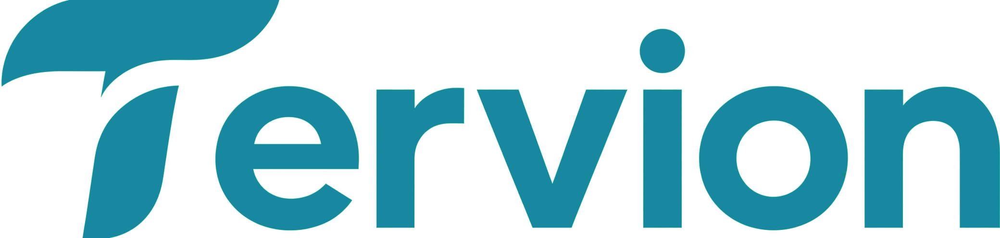

<p align="center">
  
</p>

<p align="center">
  <a href="https://github.com/sergiofrubio/tervion-app/blob/main/LICENSE"></a>
  <a href="https://www.php.net/"></a>
  <a href="https://www.docker.com/"></a>
  <a href="https://tailwindcss.com/"></a>
  <a href="https://phpunit.de/"></a>
  <a href="https://github.com/sergiofrubio/tervion-app/issues"></a>
  <a href="https://github.com/sergiofrubio/tervion-app/pulls"></a>
</p>

---

Tervion es un sistema ERP clínico modular, autoalojable y 100% de código abierto para clínicas médicas, consultas de fisioterapia y profesionales de la salud. Desarrollado en PHP moderno (PSR-4), está enfocado en la soberanía de datos del paciente, la automatización operativa y el cumplimiento legal y fiscal de la normativa española (Verifactu RD 1007/2023).

---

## 📖 Documentación para Desarrolladores

Para facilitar la incorporación de nuevos ingenieros al equipo, la documentación se ha modularizado detallando cada pilar del sistema:

* **[Guía de Inicialización (Local Setup)](file:///c:/Users/sergi/Documents/tervion-app/docs/setup.md)**: Pasos para levantar el entorno con Docker Compose, variables de entorno y credenciales por defecto.
* **[Arquitectura e Infraestructura de Software](file:///c:/Users/sergi/Documents/tervion-app/docs/architecture.md)**: Detalle del patrón MVC, el ciclo de vida de una petición HTTP, el enrutador personalizado y las políticas de acceso (ACL).
* **[Integración y Cumplimiento de Verifactu](file:///c:/Users/sergi/Documents/tervion-app/docs/features/verifactu.md)**: Detalles sobre el firmado criptográfico de facturas, generación de esquemas XML, encadenamiento de huellas (SHA-256) y remisión a la AEAT.
* **[Pasarela de Pagos Redsys](file:///c:/Users/sergi/Documents/tervion-app/docs/features/redsys.md)**: Flujo de redirección segura para compras de bonos de pacientes, notificaciones asíncronas IPN y resiliencia en local.
* **[Pruebas Unitarias y Debugging](file:///c:/Users/sergi/Documents/tervion-app/docs/testing.md)**: Cómo ejecutar PHPUnit en los contenedores y configurar Xdebug en tu IDE.
* **[Tareas Programadas (Cron Jobs)](file:///c:/Users/sergi/Documents/tervion-app/docs/cron.md)**: Automatización de recordatorios de citas y cálculo mensual de nóminas.
* **[Desarrollo de Módulos y Extensiones](file:///c:/Users/sergi/Documents/tervion-app/docs/modules_development.md)**: Arquitectura modular, manifiestos `module.json`, hooks/eventos y creación de add-ons abiertos o propietarios.
* **[Guía de Contribución (Open Source)](file:///c:/Users/sergi/Documents/tervion-app/CONTRIBUTING.md)**: Directrices, estándares de código (PSR-4/12, PDO), flujo de Git y normas para colaboradores externos.

---

## ⚡ Inicio Rápido (Quickstart)

Para levantar el entorno completo con base de datos MySQL, servidor web Caddy, PHP-FPM, Mailpit y PHPMyAdmin:

```bash
# Levantar servicios
docker compose up -d

# Ejecutar tests para validar estado inicial
docker compose exec php vendor/bin/phpunit
```

* **URL de Acceso:** [http://localhost](http://localhost)
* **Credenciales de Administrador:**
  * **Usuario:** `admin@example.com`
  * **Contraseña:** `12345678`

---

## 🛠️ Tecnologías y Estándares Core

* **PHP 8.4+** con namespaces PSR-4 y uso estricto de PDO para mitigar ataques SQL injection.
* **Tailwind CSS** para la interfaz administrativa e interactiva de pacientes.
* **Docker & Docker Compose** para asegurar entornos homogéneos e inmutables desde desarrollo local hasta producción.
* **FPDF** y **PHPMailer** para generación de reportes clínicos y envío de notificaciones por email.

---

## 📄 Licencia

Este proyecto es software libre y de código abierto bajo los términos de la **[GNU Lesser General Public License v3.0 (LGPLv3)](LICENSE)**.
Permite su uso personal y comercial, autoalojamiento ilimitado, estudio, modificación y desarrollo de extensiones o módulos complementarios.