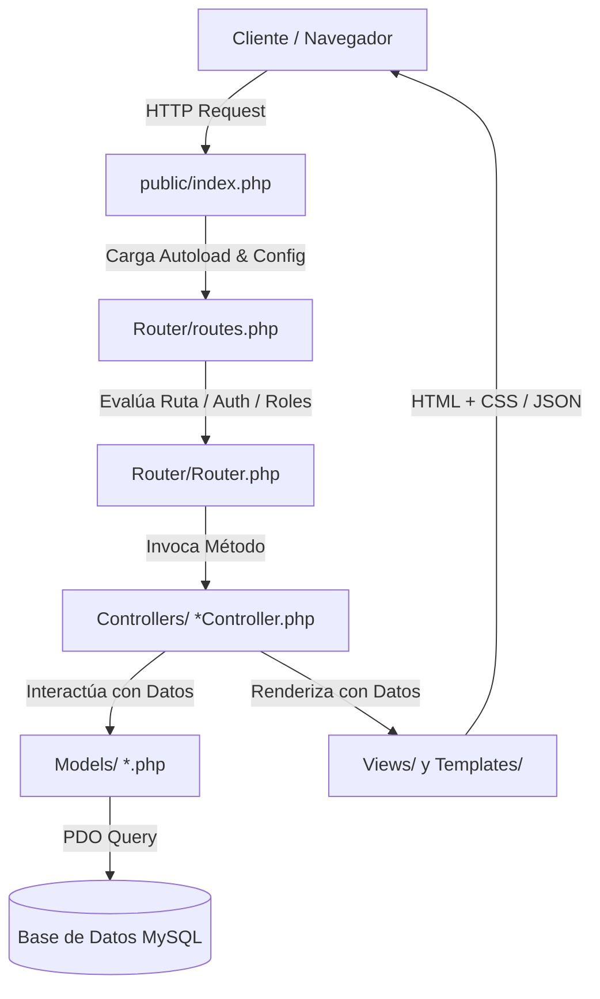

# Arquitectura del Sistema e Infraestructura de Software

Este documento proporciona una visión general y técnica de la arquitectura interna de **Velion ERP**. La aplicación está construida sobre una arquitectura modular propia basada en el patrón **MVC (Modelo-Vista-Controlador)** sin dependencias de frameworks pesados, optimizando el rendimiento y el control de la base de código.

---

## 🏗️ Patrón Arquitectónico y Flujo de Peticiones

La aplicación sigue el siguiente ciclo de vida para cualquier petición HTTP:



---

## 📂 Organización y Estructura del Código

El proyecto se adhiere al estándar de carga de clases **PSR-4** configurado en [composer.json](file:///c:/Users/sergi/Documents/velion-app/composer.json). A continuación se describe la responsabilidad de cada directorio principal:

- **[`Core/`](file:///c:/Users/sergi/Documents/velion-app/Core)**: Clases fundamentales del motor del aplicativo.
  - [DataBase.php](file:///c:/Users/sergi/Documents/velion-app/Core/DataBase.php): Abstracción e inicio del pool de conexiones utilizando **PDO** con atributos de excepción estrictos.
  - [Controller.php](file:///c:/Users/sergi/Documents/velion-app/Core/Controller.php): Controlador base que define utilidades para instanciar modelos y extraer variables a las vistas.
  - [config.php](file:///c:/Users/sergi/Documents/velion-app/Core/config.php): Constantes globales del sistema y credenciales fijas de APIs.
- **[`Router/`](file:///c:/Users/sergi/Documents/velion-app/Router)**: Gestión del enrutamiento de la aplicación.
  - [Router.php](file:///c:/Users/sergi/Documents/velion-app/Router/Router.php): Parser de peticiones URL, manejo de sesiones de usuario y validación de ACL (Access Control Lists).
  - [routes.php](file:///c:/Users/sergi/Documents/velion-app/Router/routes.php): Declaración de todas las rutas HTTP del sistema, especificando el método, controlador, políticas de autenticación y roles permitidos.
- **[`Controllers/`](file:///c:/Users/sergi/Documents/velion-app/Controllers)**: Interceptores de las peticiones HTTP que ejecutan la lógica de orquestación del negocio.
- **[`Models/`](file:///c:/Users/sergi/Documents/velion-app/Models)**: Representación de las entidades de negocio y abstracción de consultas SQL directas a través de PDO.
- **[`Views/`](file:///c:/Users/sergi/Documents/velion-app/Views)**: Plantillas PHP/HTML que componen la interfaz del usuario.
- **[`Templates/`](file:///c:/Users/sergi/Documents/velion-app/Templates)**: Fragmentos de código UI reutilizables (layouts de navegación, modales, etc.).
- **[`Services/`](file:///c:/Users/sergi/Documents/velion-app/Services)**: Capas de servicio externas integradas, encapsulando la complejidad de las integraciones (como Verifactu).

---

## 🚦 Enrutamiento y Sistema de Permisos (ACL)

El motor de enrutamiento implementado en [Router.php](file:///c:/Users/sergi/Documents/velion-app/Router/Router.php) evalúa los siguientes parámetros para cada ruta registrada mediante `$router->add($method, $url, $action, $auth, $roles)`:

1. **Método HTTP:** `GET` o `POST`.
2. **Path de la Solicitud:** Extracción del URI base, limpiando parámetros Query String (`strtok($requestUrl, '?')`).
3. **Control de Autenticación (`auth`):** Si es `true`, comprueba la existencia de la variable de sesión `$_SESSION['usuario_id']`. Si no existe, detiene la ejecución del script renderizando una vista `404.php`.
4. **Control de Roles (`roles`):** Permite restringir el acceso a un array de roles autorizados (ej. `['Administrador', 'Fisioterapeuta']`). Compara el rol almacenado en `$_SESSION['rol']`. Si el usuario no cuenta con un rol válido, bloquea el acceso redirigiendo a la pantalla 404.

---

## 🗄️ Persistencia de Datos y Seguridad SQL

El sistema no utiliza ORMs (como Eloquent o Doctrine), lo que permite escribir consultas nativas altamente optimizadas. Para prevenir ataques de **Inyección SQL**:
- Se utiliza exclusivamente **PDO (PHP Data Objects)** con consultas preparadas (`prepare` y `execute`).
- El driver de PDO está configurado en modo estricto de excepciones:
  ```php
  $this->conn->setAttribute(PDO::ATTR_ERRMODE, PDO::ERRMODE_EXCEPTION);
  ```
- Nunca se concatenan variables directamente en cadenas de consulta SQL.
