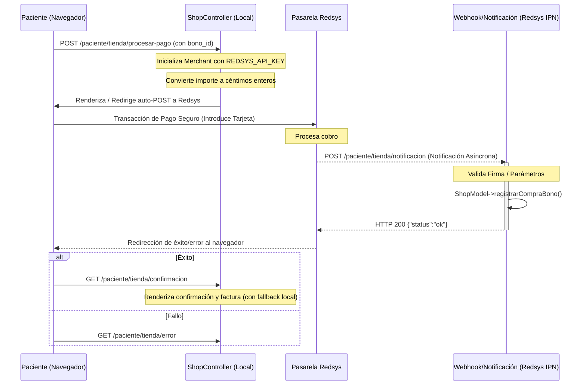

# Integración de Pagos con Pasarela Redsys

Este documento describe la arquitectura y el flujo de integración de la pasarela de pagos **Redsys** en el módulo de compra de bonos de pacientes.

---

## 🔁 Flujo de la Transacción

El sistema utiliza la modalidad de redirección estándar de Redsys (3DSecure) para garantizar la seguridad de los datos de pago y transferir la responsabilidad del cumplimiento PCI-DSS a la pasarela.

---

## 🛠️ Clases y Componentes Implicados

### 1. [`ShopController.php`](file:///c:/Users/sergi/Documents/velion-app/Controllers/ShopController.php)
Controlador encargado de orquestar el flujo comercial y de pagos:
- `list()`: Muestra los bonos activos configurados en el sistema de gestión.
- `procesarPago()`: 
  - Genera una orden única a través de `time()` (un número de 10 dígitos requerido por Redsys).
  - Multiplica el importe por 100 y lo castea a un número entero (ej. `45.50` € -> `4550` céntimos).
  - Inicializa la clase `Redsys\Merchant` a través del token `REDSYS_API_KEY` definido en [config.php](file:///c:/Users/sergi/Documents/velion-app/Core/config.php).
  - Delega la redirección en `Redsys\Redirect::authorisation()`.
- `notificacion()`: 
  - Punto de entrada de la Notificación Online Asíncrona (IPN).
  - Valida la autenticidad e integridad de la firma con `Redsys\Parameters::digest()`.
  - Si el código de respuesta está entre `0000` y `0099`, registra la compra del bono llamando a `Shop->registrarCompraBono()`.
- `confirmacion()`:
  - Muestra el resultado de la compra.
  - **Mecanismo de Resiliencia en Desarrollo (Fallback):** En entornos locales (`localhost`), los servidores de Redsys no pueden invocar el webhook de notificación asíncrona de forma externa. Por ello, este método detecta si la factura no ha sido creada por la IPN, y realiza el registro del bono localmente para facilitar las pruebas del desarrollador.

### 2. Biblioteca Redsys (`Redsys\`)
Ubicada en `vendor/redsys-lib/src/`, es una biblioteca que abstrae la firma HMAC-SHA256 necesaria para las comunicaciones seguras con el TPV virtual de Redsys.

---

## ⚙️ Configuración y Entornos

La constante `REDSYS_API_KEY` en [config.php](file:///c:/Users/sergi/Documents/velion-app/Core/config.php) almacena la clave criptográfica para firmar los mensajes.

- **Entorno de Sandbox / Integración:** Se usa un TPV virtual ficticio provisto por Redsys con tarjetas de prueba. La URL del TPV y las claves son del entorno de pruebas de Redsys.
- **Entorno de Producción:** Debe reemplazarse la constante con la clave real provista por la entidad bancaria a través de su portal de administración TPV.
