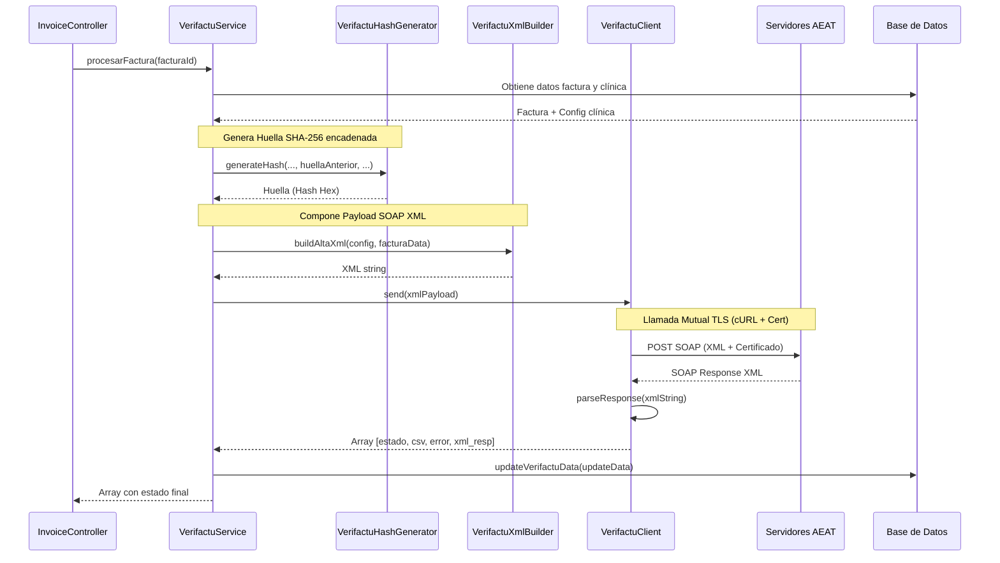

# Módulo de Facturación y Cumplimiento Verifactu (AEAT)

Este documento detalla la implementación del módulo de integración con **Verifactu**, el reglamento español para sistemas de facturación electrónica que garantiza la inalterabilidad, trazabilidad e integridad de los registros de facturación (remisión directa a la Agencia Tributaria - AEAT).

---

## 🔁 Arquitectura y Flujo de Datos

El ciclo de envío y persistencia de facturas en el sistema sigue el flujo descrito a continuación:



---

## 🛠️ Clases e Interfaces Core

El módulo Verifactu reside bajo el espacio de nombres `App\Services\Verifactu` y consta de los siguientes componentes principales:

### 1. [`VerifactuService.php`](file:///c:/Users/sergi/Documents/velion-app/Services/Verifactu/VerifactuService.php)
Es la fachada y orquestador del módulo. 
- Valida si Verifactu está activo en la clínica.
- Genera el huso horario estándar ISO8601 (`date('c')`).
- Recupera el hash de la última factura para encadenarla como `huella_anterior`.
- Invoca la generación del código QR y el XML.
- Almacena en base de datos la petición y la respuesta XML completas para auditorías de no repudio.

### 2. [`VerifactuHashGenerator.php`](file:///c:/Users/sergi/Documents/velion-app/Services/Verifactu/VerifactuHashGenerator.php)
Implementa el algoritmo de encadenamiento requerido por ley. Genera un hash SHA-256 en mayúsculas a partir de la concatenación ordenada de los atributos clave de la factura:
```php
$cadena = "IDEmisorFactura=" . $nifEmisor .
          "&NumSerieFactura=" . $numSerieFactura .
          "&FechaExpedicionFactura=" . $fechaExpedicion .
          "&TipoFactura=" . $tipoFactura .
          "&CuotaTotal=" . $cuotaFormatted .
          "&ImporteTotal=" . $importeFormatted .
          "&Huella=" . $huellaAnterior .
          "&FechaHoraHusoGenRegistro=" . $fechaHoraHusoGenRegistro;
```
Este diseño garantiza que no se puedan borrar ni modificar facturas intermedias sin romper el encadenamiento de la base de datos completa.

### 3. [`VerifactuXmlBuilder.php`](file:///c:/Users/sergi/Documents/velion-app/Services/Verifactu/VerifactuXmlBuilder.php)
Construye el XML de alta de factura (`RegistroAlta`) dentro de un sobre SOAP estándar. Añade los namespaces requeridos y formatea las etiquetas de acuerdo al esquema oficial XSD de la AEAT.

### 4. [`VerifactuClient.php`](file:///c:/Users/sergi/Documents/velion-app/Services/Verifactu/VerifactuClient.php)
Cliente de comunicaciones basado en **cURL**. Realiza una petición POST segura configurando TLS y cargando el certificado del cliente en formato `.pem` (`CURLOPT_SSLCERT` y `CURLOPT_SSLCERTPASSWD`) obtenido de la configuración de la clínica.
Adicionalmente, se encarga de:
- Limpiar dinámicamente los namespaces SOAP de la respuesta para parsear la información mediante `SimpleXMLElement`.
- Interpretar errores HTTP y `SOAP Faults`.

### 5. [`VerifactuQRGenerator.php`](file:///c:/Users/sergi/Documents/velion-app/Services/Verifactu/VerifactuQRGenerator.php)
Genera el enlace del código QR que es obligatorio incluir de forma impresa en la factura del cliente final, permitiendo al consumidor verificar directamente en la AEAT la autenticidad y el envío de su factura.

---

## 🔒 Certificados y Modos de Ejecución

La AEAT ofrece dos modos de conexión:
1. **Entorno de Pruebas (Sandbox):** Requiere un certificado digital de pruebas de la FNMT. Se utiliza para testear el sistema.
2. **Entorno de Producción:** Requiere el certificado digital corporativo de la clínica.

La parametrización del entorno de pruebas vs producción y la ruta del archivo del certificado se definen en el panel de configuración de la clínica dentro del software (`SettingController.php`).

---

## 📋 Auditoría y Gestión de Respuestas (Estados)

Todas las transacciones guardan información exhaustiva en la tabla `facturas`:
- `estado_verifactu`: `Aceptado`, `AceptadoConErrores`, o `Rechazado`.
- `csv_verifactu`: Código Seguro de Verificación devuelto por la AEAT.
- `fecha_envio_verifactu`: Timestamp de comunicación.
- `xml_peticion` y `xml_respuesta`: Contenido íntegro de la comunicación en formato XML.
